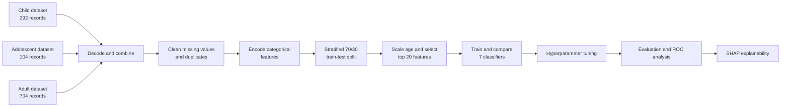

<h1 align="center">Autism Spectrum Disorder Screening with Machine Learning & Explainable AI</h1>

<p align="center">
  A comparative machine-learning study for ASD screening across child, adolescent, and adult questionnaire datasets, with model tuning and SHAP-based explainability.
</p>

<p align="center">
  
  
  
  
  
</p>

> [!IMPORTANT]
> This repository is an educational research project for questionnaire-based ASD screening classification. It is **not a medical diagnostic system** and must not replace evaluation by qualified healthcare professionals.

## Overview

This project investigates machine-learning approaches for classifying Autism Spectrum Disorder (ASD) screening outcomes. The notebook combines three ARFF datasets covering children, adolescents, and adults, cleans and encodes the data, selects informative features, compares seven classification algorithms, tunes their hyperparameters, and applies SHAP to selected models.

The complete analysis is available in [`thesis.ipynb`](./thesis.ipynb).

### Highlights

- Combines child, adolescent, and adult ASD screening records.
- Handles missing values, duplicates, categorical variables, and feature scaling.
- Selects 20 features using the chi-square statistical test.
- Compares seven classification algorithms using stratified cross-validation.
- Tunes every model with `RandomizedSearchCV`.
- Evaluates accuracy, precision, recall, F1 score, balanced accuracy, MCC, Cohen's kappa, and ROC-AUC.
- Uses SHAP to examine predictions from Logistic Regression, SVM, Random Forest, and XGBoost.

## Workflow



## Dataset

The notebook loads three external ARFF files. They are not included in this repository.

| Cohort | File | Records | Columns |
|---|---|---:|---:|
| Child | `Autism-Child-Data.arff` | 292 | 21 |
| Adolescent | `Autism-Adolescent-Data.arff` | 104 | 21 |
| Adult | `Autism-Adult-Data.arff` | 704 | 21 |
| **Combined** | — | **1,100** | **21** |

After eight duplicate records are removed, the analysis uses 1,092 observations. The encoded modeling matrix contains 118 input features and one binary target.

### Main variables

- Screening responses: `A1_Score` through `A10_Score`
- Demographic/context variables: `age`, `gender`, `ethnicity`, `jundice`, `austim`, `contry_of_res`, `used_app_before`, and `relation`
- Target: `Class/ASD`, encoded as `NO = 0` and `YES = 1`
- Removed columns: `age_desc` and `result`

Some source column names contain spelling inconsistencies—such as `jundice`, `austim`, and `contry_of_res`—and are retained in the notebook to match the original files.

The adult cohort corresponds to the [UCI Autism Screening Adult dataset](https://archive.ics.uci.edu/dataset/426/autism%2Bscreening%2Badult). When using the data in research, review and cite the original dataset documentation for each cohort.

## Data Preparation

The executed notebook performs the following steps:

1. Loads the three ARFF files with `scipy.io.arff`.
2. Decodes byte-valued categorical fields to UTF-8 strings.
3. Concatenates all age-group datasets.
4. Replaces `?` values with missing values.
5. Fills six missing ages with the rounded mean age.
6. Fills 144 missing `ethnicity` values and 144 missing `relation` values with `Others`.
7. Removes eight duplicate records.
8. Drops `age_desc` and the aggregate `result` column.
9. Converts the ten questionnaire scores to integers.
10. One-hot encodes `ethnicity`, `contry_of_res`, and `relation`.
11. Label-encodes binary categorical fields and the target.
12. Creates a stratified 70/30 split with `random_state=42`:
    - Training set: 764 records
    - Test set: 328 records
13. Applies min-max scaling to `age`.
14. Selects the top 20 features with `SelectKBest(chi2)`.

## Models

The following classifiers are evaluated:

- Gaussian Naive Bayes
- K-Nearest Neighbors
- Logistic Regression
- Support Vector Machine
- Decision Tree
- Random Forest
- XGBoost

Baseline evaluation uses five-fold `StratifiedKFold` cross-validation. Hyperparameter optimization uses `RandomizedSearchCV` with 20 sampled configurations per model and accuracy as the optimization score.

## Results

The table below reproduces the tuned results reported by the executed notebook.

| Model | Best CV Accuracy | Test Accuracy | Precision | Recall | F1 Score | ROC-AUC |
|---|---:|---:|---:|---:|---:|---:|
| Naive Bayes | 0.8705 | 0.9299 | 0.9700 | 0.8291 | 0.8940 | 0.9875 |
| KNN | 0.9437 | 0.9482 | 0.8846 | 0.9829 | 0.9312 | 0.9950 |
| Logistic Regression | **1.0000** | **1.0000** | **1.0000** | **1.0000** | **1.0000** | **1.0000** |
| SVM | **1.0000** | **1.0000** | **1.0000** | **1.0000** | **1.0000** | **1.0000** |
| Decision Tree | 0.9058 | 0.9085 | 0.8718 | 0.8718 | 0.8718 | 0.9239 |
| Random Forest | 0.9608 | 0.9695 | 0.9652 | 0.9487 | 0.9569 | 0.9957 |
| XGBoost | 0.9778 | 0.9939 | 0.9832 | **1.0000** | 0.9915 | 0.9997 |

Logistic Regression and linear SVM tie for the highest notebook-reported tuned performance. XGBoost is the next-best model by held-out test accuracy.

> [!CAUTION]
> These are internal notebook results, not externally validated clinical performance. The target is closely related to the same questionnaire responses used as predictors, which can make the classification task nearly deterministic and likely contributes to the perfect scores.

<details>
<summary><strong>Baseline results</strong></summary>

| Model | CV Accuracy | Test Accuracy | F1 Score | ROC-AUC |
|---|---:|---:|---:|---:|
| Naive Bayes | 0.8207 | 0.8201 | 0.6629 | 0.9875 |
| KNN | 0.9319 | 0.9543 | 0.9393 | 0.9893 |
| Logistic Regression | 1.0000 | 1.0000 | 1.0000 | 1.0000 |
| SVM | 0.9803 | 0.9787 | 0.9700 | 0.9989 |
| Decision Tree | 0.8900 | 0.8902 | 0.8500 | 0.8861 |
| Random Forest | 0.9503 | 0.9695 | 0.9576 | 0.9958 |
| XGBoost | 0.9529 | 0.9695 | 0.9583 | 0.9981 |

</details>

## Explainable AI

SHAP is used to analyze four tuned classifiers:

| Model | SHAP explainer |
|---|---|
| Logistic Regression | `LinearExplainer` |
| SVM | `KernelExplainer` |
| Random Forest | `TreeExplainer` |
| XGBoost | `TreeExplainer` |

The notebook produces global summary plots, mean absolute SHAP importance charts, dependence plots, and individual waterfall explanations. The SVM explanation uses 50 background samples and explains 50 test samples to keep `KernelExplainer` computationally manageable.

See [Known Limitations](#known-limitations) before interpreting the current SHAP feature labels.

## Installation

### 1. Clone the repository

```bash
git clone https://github.com/Mansur550/Autism-Spectrum-Disorder.git
cd Autism-Spectrum-Disorder
```

### 2. Create and activate a virtual environment

```bash
python -m venv .venv
```

Windows PowerShell:

```powershell
.\.venv\Scripts\Activate.ps1
```

Linux or macOS:

```bash
source .venv/bin/activate
```

### 3. Install dependencies

```bash
python -m pip install --upgrade pip
pip install jupyterlab numpy pandas matplotlib seaborn scipy scikit-learn imbalanced-learn xgboost shap kagglehub
```

The recorded Kaggle run used Python 3.12.13. A GPU is not required.

## Dataset Setup

### Kaggle

The notebook was developed in Kaggle and expects the following paths:

```text
/kaggle/input/datasets/mansurislam/child-dataset/Autism-Child-Data.arff
/kaggle/input/datasets/mansurislam/teenage-data/Autism-Adolescent-Data.arff
/kaggle/input/datasets/mansurislam/adult-dataset/Autism-Adult-Data.arff
```

Attach the three datasets to the notebook before selecting **Run All**.

### Local execution

Download the three ARFF files and organize them locally, for example:

```text
data/
├── child/Autism-Child-Data.arff
├── adolescent/Autism-Adolescent-Data.arff
└── adult/Autism-Adult-Data.arff
```

Then replace the three hard-coded Kaggle paths in `thesis.ipynb` with the corresponding local paths.

## Running the Notebook

Start JupyterLab:

```bash
jupyter lab
```

Open `thesis.ipynb` and run its cells from top to bottom. Later evaluation and SHAP sections depend on variables created by earlier cells.

## Generated Artifacts

Running the complete notebook writes the following files to the active working directory:

```text
ROC_Curve_Tuned_Models.png
Performance_Barplot.png
XGBoost_SHAP_Summary.png
XGBoost_SHAP_Bar.png
XGBoost_SHAP_Feature_Importance.csv
RF_SHAP_Summary.png
RF_SHAP_Bar.png
RF_SHAP_Feature_Importance.csv
LR_SHAP_Summary.png
LR_SHAP_Bar.png
LR_SHAP_Feature_Importance.csv
SVM_SHAP_Summary.png
SVM_SHAP_Bar.png
SVM_SHAP_Feature_Importance.csv
```

The repository currently contains the notebook rather than these generated files.

## Project Structure

```text
AutismDetaction/
├── thesis.ipynb    # Data preparation, modeling, evaluation, and SHAP analysis
└── README.md       # Project documentation
```

## Reproducibility

- Python version recorded in the notebook: 3.12.13
- Execution environment: Kaggle CPU runtime
- Train/test split: stratified 70/30
- Cross-validation: five-fold stratified CV
- Random seed: 42 where supported
- Feature selection: chi-square, `k=20`

## Known Limitations

1. **Screening is not diagnosis.** The notebook predicts a questionnaire-derived class and has not been clinically validated.
2. **The target is closely coupled to the inputs.** `Class/ASD` may be determined largely by the `A1_Score`–`A10_Score` questionnaire fields. Dropping the aggregate `result` field reduces direct leakage but does not make the target independent of its component answers.
3. **Some preprocessing occurs before the split.** Mean imputation, category discovery, and duplicate removal are performed on the combined dataset. A production-quality experiment should fit all learned preprocessing only on each training fold.
4. **Age is scaled twice.** The notebook manually scales `age` and then includes another min-max transformation inside the modeling pipeline.
5. **SHAP feature names require correction.** `ColumnTransformer` changes the feature order, but the current SHAP code maps the selector mask onto the original column order. The plots are generated, but their displayed feature labels should be verified before scientific interpretation.
6. **The confusion-matrix section uses baseline models.** It reads from `trained_models`, not the tuned-model dictionary.
7. **No external validation is included.** Results come from one combined dataset and one held-out split.
8. **No model is persisted.** The notebook does not currently save a trained pipeline or provide an inference API.

## Future Improvements

- Move imputation, encoding, scaling, and feature selection into one leakage-safe pipeline.
- Use `OneHotEncoder(handle_unknown="ignore")` and preserve transformed feature names with `get_feature_names_out()`.
- Validate results with nested cross-validation and an independent external cohort.
- Evaluate calibration, decision thresholds, and performance separately across age and demographic groups.
- Correct the SHAP feature mapping and regenerate all explainability artifacts.
- Save the validated pipeline and add a reproducible inference script or API.
- Add a data card, model card, requirements lock file, automated tests, and an explicit repository license.

## Author

**Mansur Islam**

- GitHub: [@Mansur550](https://github.com/Mansur550)
- LinkedIn: [mansur-islam](https://www.linkedin.com/in/mansur-islam/)

## Responsible Use

Use this project to study machine-learning workflows and explainability—not to make clinical decisions. Any real-world ASD screening application requires qualified clinical oversight, appropriate consent and privacy controls, representative validation data, fairness analysis, and compliance with applicable healthcare regulations.
